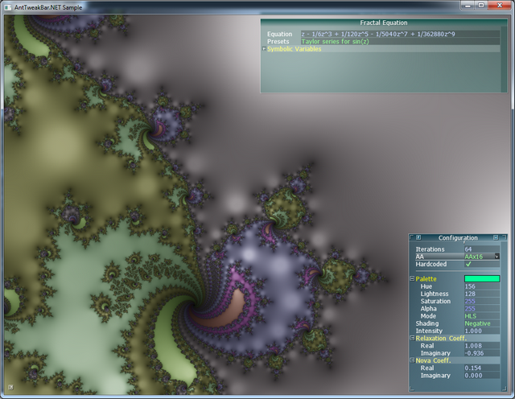

AntTweakBar.NET 0.5.0
=====================

AntTweakBar.NET is an MIT-licensed C# wrapper for Philippe Decaudin's [AntTweakBar](http://anttweakbar.sourceforge.net) C/C++ GUI library. It allows C# developers to enhance their tech demos or games with an easy-to-use graphical widget for modifying application parameters in realtime. AntTweakBar.NET offers a high-level interface to the widget which will feel natural to any C# programmer, and also provides access to exception-safe bindings to the native AntTweakBar calls for those who might want them.

AntTweakBar.NET runs on the Microsoft .NET framework and on the Mono runtime, both 32-bit and 64-bit (provided it can find the appropriate AntTweakBar DLL or shared library). It has been tested on Windows and Linux, and is expected to work - but has not yet been tested - on Mac OS X and presumably BSD.

License
-------

The AntTweakBar.NET wrapper is distributed under the MIT license, while AntTweakBar itself by Philippe Decaudin is released under the zlib/libpng license. For more information on licensing of this software, please consult the LICENSE file.

Quick Start
-----------

You must obtain and install the native AntTweakBar library itself from its [SourceForge page](http://anttweakbar.sourceforge.net/doc/tools:anttweakbar:download), if you haven't already. For Windows, download the appropriate prebuilt DLL's and install them on your system or as third party libraries in your C# project. For Linux, simply `make && make install` as usual (note: the 64-bit Windows DLL is called AntTweakBar64.dll, remove the "64" prefix). Then add the `AntTweakBar.NET.dll` assembly in your project, either by compiling it from the repository or retrieving it from [NuGet](https://www.nuget.org/packages/AntTweakBar.NET/). You're good to go!

The AntTweakBar.NET high-level interface is divided into four main concepts: contexts, bars, variables and groups.

- **Context**: An instance of this class conceptually maps to a graphical window in your application: each window that will contain bars should have its own context. Each context holds its own separate set of bars, and has several methods to send window events to AntTweakBar, and, of course, draw the bars into the window.

- **Bar**: An instance of this class represents a graphical bar which holds a set of variables. It has several useful properties to tweak the bar to your application's needs. Each bar belongs to a context passed to its constructor.
 
- **Variable**: This is the base class from which all other variable types (like `IntVariable` or `StringVariable`) descend from. Just like the `Bar` class, it and its descendants have plenty of properties you can modify to tweak the variable's behavior and graphical appearance. In addition, value variables hold a value property which can be set graphically by the user and can be read on the fly by your code, this is the `Value` property for simple types (like `IntVariable`) or e.g. the `X`, `Y`, `Z` properties for the `VectorVariable`. They also have a `Changed` event to be notified when the user changes the variable's value. The `Button` variable type has a `Clicked` event instead. Each variable belongs to a bar passed to its constructor.

- **Group**: These are used to put a set of variables together in the bar for easy access, you can open (expand) or close (collapse) groups, and can put groups into groups for a hierarchical organization. Please see "Using groups" in the advanced usage section below to find out how to use them. 

The first context created should be passed the graphics API you are using, which is some version of OpenGL or DirectX. For DirectX, you must also pass a pointer to the native device, which should be available from the graphics framework you are using somehow (for instance, for SharpDX, use `SharpDX.Direct3D11.Device.NativePointer`).

```csharp
using AntTweakBar;

/* ... */

context = new Context(Tw.GraphicsAPI.Direct3D11, /* pointer to device */);
```

Other contexts do not have to provide a graphics API, and can be created as simply `new Context();`. AntTweakBar.NET keeps track of how many contexts are active, and initializes the AntTweakBar library whenever a first one is created, and terminates the library whenever the last one is destroyed.

Once you have a context, you can create bars inside it, and you can create variables inside these bars. To draw the context, call its `Draw()` method at the very end of your rendering pipeline. To handle events, hook up the various `Handle*()` methods to your window events. Keep in mind that you generally do not need to keep references to variables around. In many cases, it is sufficient to set up a delegate on the variable's `Changed` event to automatically modify some property in another class, so that your program automatically responds to variable changes.

```csharp
var myBar = new Bar(context);
myBar.Label = "Some bar";
myBar.Contained = true; // set some bar properties

var rotationVar = new IntVariable(myBar, 42 /* default value */);
rotationVar.Label = "Model rotation";
rotationVar.Changed += delegate { model.Rotation = rotationVar.Value; };

/* don't need rotationVar anymore (it will still be held onto by myBar) */
```

Generic event handling example to illustrate (this is not the only event you need to handle):

```csharp
protected override void OnResize(EventArgs e)
{
    base.OnResize(e);
    context.HandleResize(this.ClientSize);
}
```

The preferred way of doing event handling is by using the `Handle*()` events, which means you have to do some event translation. However, if you are using a particular framework, it may be possible to use ready-made event handlers. For instance, if you are using WinForms and happen to have access to your form's `WndProc` (perhaps because you are already overriding it) then you can use `EventHandlerWin()` to handle all events except perhaps `HandleResize` in a single line of code. There is currently such support for WinForms, SFML (via SFML.Net), X11 events and SDL (untested). The other two handlers supported by AntTweakBar (GLFW and GLUT) use per-event callbacks, so it probably does not make much sense wrapping them as your respective GLFW or GLUT wrapper should already convert them into events or delegates for you. Using the generic handlers works anywhere, though.

In general you *do* want to keep references to contexts, because you actually do need to destroy them when you close your windows. The different AntTweakBar.NET classes implement the `IDisposable` interface. When you dispose a bar, all variables inside it are implicitly disposed. When you dispose a context, all bars inside it are implicitly disposed. In other words, it is sufficient to dispose the contexts you create. It is very important to note that you must dispose the last context **before** terminating your graphics API. A symptom of failing to do this is an exception on shutdown pointing to the `Tw.Terminate()` function. Critically, this means you cannot just leave the contexts to be garbage-collected, as it will probably be too late by the time they are. This should not be a problem in most sensible implementations.  

For more information, make sure to check out the [wiki](wiki) (it's not finished, but already has some helpful content).

Notes on the Sample
-------------------

This repository contains a sample, among other things, which is intended to show what a concrete graphics tech demo using AntTweakBar.NET might look like. The sample is an interactive Newton fractal renderer, and is released under the same license as the wrapper. All of the relevant wrapper usage is in `Program.cs`, the rest is just, you know, code. It uses the [OpenTK framework](http://www.opentk.com/), and is cross-platform (OpenTK will be fetched through NuGet - if you have compile errors, try a package restore).

<p align="center">
</img> 
</p>

Contribute
----------

Any issues or pull requests are welcome, I especially need help with verifying multi-window support, thread safety, and OS X testing, but any contribution is greatly appreciated. Thanks to *Ilkka Jahnukainen* for helping in testing AntTweakBar.NET throughout its ongoing development and providing valuable feedback to guide its design.

Changelog
---------

16 December 2014 (v0.5.0):

 - changed `Tw.WindowSize` to accept sizes of (0, 0) to allow AntTweakBar resource cleanup (see [#3](https://github.com/TomCrypto/AntTweakBar.NET/issues/3))
 - added `ReleaseResources` and `ResetResources` methods to the `Context` class (see [#3](https://github.com/TomCrypto/AntTweakBar.NET/issues/3))
 - changed Sample to use GLSL version 120, fixed shader saving overwrite bug and close on Esc.
 - added TwDefineEnum and TwDefineStruct native functions and a DefineEnum low-level wrapper
 - various miscellaneous fixes and improvements to the Sample
 - added `Group` class and improved code relating to variable groups
 - added `StructVariable` abstract class
 - improved input handling (see [#4](https://github.com/TomCrypto/AntTweakBar.NET/issues/4))

28 November 2014 (v0.4.4)

 - fixed an interop bug for 32-bit Windows (see [#1](https://github.com/TomCrypto/AntTweakBar.NET/issues/1))
 - changed Sample from using Tw.GraphicsAPI.OpenGLCore to Tw.GraphicsAPI.OpenGL for increased compatibility

26 November 2014 (v0.4.3)

 - added a few missing AntTweakBar functions in the low-level wrapper
 - added convenience Clear methods to bar and context
 - added MoveGroup method for nested groups

21 November 2014 (v0.4.2)

 - fixed a few more bugs in the sample
 - added ObjectDisposedException safety
 - sealed all classes and added validation events
 - updated to a new fancy readme file
 - removed the tutorial (the readme now has a quick start containing the same info)

20 November 2014 (v0.4.1)

 - bug fix release, fixed numerous bugs including:
   * string variable validation now works properly (previously threw exception instead of reverting)
   * groups names with spaces now work correctly
   * a few OnChanged methods were incorrectly private, they are now all public
   * unmanaged callbacks will now no longer be garbage-collected, which previously caused crashes
 - extended the sample with the ability to use symbolic variables in the fractal formula
 - extended the sample to be able to choose between hardcoding the fractal in the shader (efficient, but slow to update) and passing it as a uniform (a bit slower, but much faster to update)
 - fixed a bug in the polynomial class' Degree property

19 November 2014 (v0.4.0)

 - major refactoring, improvements and bug fixes
 - a few public changes, mostly renaming and moving things around
 - made the low-level wrapper API accessible to users in addition to the high-level classes
 - removed all unsafe code

18 November 2014 (v0.3.9)

 - tidied up project structure
 - fixed broken OpenTK references
 - added note about OpenTK references
 - renamed sample project window

18 November 2014 (v0.3.8)

 - uploaded wrapper to NuGet

4 September 2014 (v0.1.0)

 - added coordinate axes property
   (vectors/quaternions)

26 June 2014

 - added sample
 - many bug fixes
 - removed wrappers and redesigned composite types
   (colors/vectors/quaternions)

28 May 2014

 - added char overload for HandleKeyPress

24 May 2014

 - added wrappers for color/vector types

21 April 2014

 - first release
