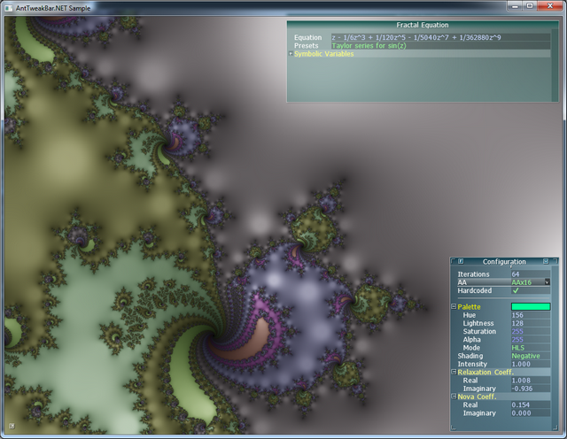
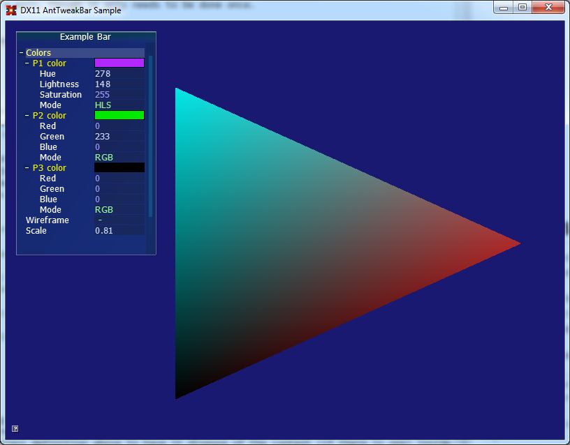

AntTweakBar.NET Samples
=======================

OpenGL Sample
-------------

Full Newton fractal renderer. The AntTweakBar.NET code is in `Program.cs`. In contrast to the D3D11 sample which uses  (see below) the AntTweakBar library does not know the OpenTK graphics system, so there is no easy shortcut for handling events, which is why the sample needs to translate OpenTK events to AntTweakBar events (e.g. the key type dictionary). This is a bit of a pain, though it only needs to be done once.

<p align="center">
</img> 
</p>

SharpDX Sample
--------------

This is almost directly lifted from the MiniTri SharpDX D3D11 sample, but has reliable cleanup code and creates the device and swapchain separately. The AntTweakBar.NET controls are fairly basic (some color variables, a boolean variable, etc...) but it should be helpful.

If you are already familiar with both SharpDX and AntTweakBar.NET, possibly the most useful thing in this sample is the ATBRenderForm class, which is just the SharpDX RenderForm class but with an optional AntTweakBar.NET context hooked to its message pump, which automatically handles AntTweakBar.NET input events for you and should be sufficient for most usecases. It is quite short as well:

```csharp
public class ATBRenderForm : RenderForm
{
    public Context Context { get; set; }

    public ATBRenderForm() : base() {}
    public ATBRenderForm(String text) : base(text) {}

    protected override void WndProc(ref System.Windows.Forms.Message m)
    {
        if ((Context == null) || !Context.EventHandlerWin(m.HWnd, m.Msg, m.WParam, m.LParam)) {
            base.WndProc(ref m);
        }
    }
};
```

That's it. If you are already using the RenderForm, this should be a drop-in replacement and you can then attach a context to it whenever and start creating bars and variables. You still have to dispose of it yourself though, but if you want to you can modify the class definition above to have it dispose of the context (if there is one) inside its own Dispose method.

<p align="center">
</img> 
</p>